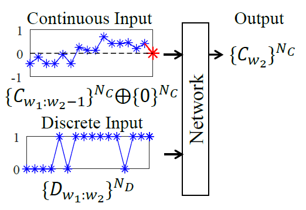
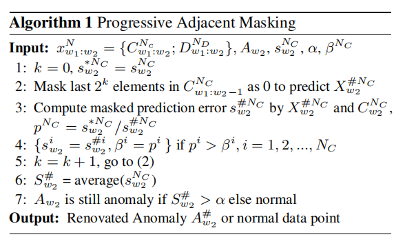
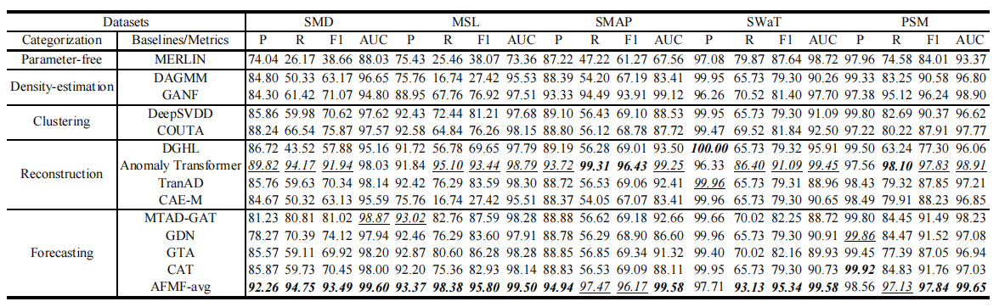

# AFMF: Time Series Anomaly Detection Framework With Modified Forecasting


This is the origin Pytorch implementation of AFMF in the following paper: 
[AFMF: Time Series Anomaly Detection Framework With Modified Forecasting], which has been submitted to Knowledge-Based Systems.

## Components of AFMF
<p align="center">

<br><br>
<b>Figure 1.</b> An overall algorithm flows of forecasting-based anomaly detection with AFMF. All of components changed/added by AFMF are emphasized in red. Oplus ($ \oplus $) refers to concatenation operation.
</p>

### Local Instance Normalization (LIN)
We propose Local Instance Normalization (LIN) which performs normalization per window $ x_{w_1:w_2}^N $ (Equation 1) as the preprocessing procedure to replace the conventional one which normalizes all data points with statistics of the entire dataset (Equation 2). $ [w_1,w_2] $ denotes time span of a certain window and $ [u_1,u_2] $ denotes time span of train subset. ${x}_{w_1:w_2}^i$ refer to obversations in the dataset of the $ i $-th variate spanning this window and $ \hat{x}_{w_1:w_2}^i $ are after normalization.

<p align="center">

<br><br>

</p>

### Lopsided Forecasting (LF)
As shown in Figure 2, inputs and outputs of Lopsided Forecasting (LF) are different from canonical forecasting format: (1) Inputs. Continuous variates are masked at prediction timestamp; Discrete variates are entirely inputted, including values at prediction timestamp. (2) Outputs. Only continuous variates are predicted. As the whole window, including observations of input and prediction parts, are all known in anomaly detection tasks, it is reasonable to utilize the value of discrete variates at prediction timestamps as inputs. When combining LF with LIN, we do not apply LIN to discrete variates, otherwise their implicit information will be damaged.
<p align="center">

<br><br>
<b>Figure 2.</b> Lopsided forecasting only forecasts continuous variates $ \{C_{{w_2}}\}^{N_C} $ and its inputs extra include discrete variates at prediction timestamp $ \{D_{{w_2}}\}^{N_D} $. Additional zero $ \{0\}^{N_C} $ (red asterisk) concatenated with continuous inputs $ \{C_{{w_1:w_2-1}}\}^{N_C} $ is to ensure the same length with discrete inputs $ \{D_{{w_1:w_2}}\}^{N_D} $.
</p>

### Progressive Adjacent Masking (PAM)
In practice, our proposed Progressive Adjacent Masking (PAM) is a progressive algorithm which avoids to decide the number of adjacent elements to mask. The pseudo-code of it is shown in Algorithm 1. $ N $ refers to the number of variates. $ A_{w_2} $ is certain anomaly detected by prediction error at $ w_2 $ ($ S_{w_2}^N $) and anomaly threshold ($ \alpha $) given by certain forecasting network. $ \beta^N $ is the hyper-parameter to initialize the decline ratio to determine whether the prediction error degradation is distinct enough to validate that the new prediction error after masking is more reliable.
<p align="center">

<br><br>
</p>

## Requirements

- python == 3.8.8
- numpy == 1.20.1
- pandas == 1.2.4
- scipy == 1.9.0
- scikit_learn == 0.24.1
- torch == 1.11.0
- torch-cluster == 1.6.0
- torch-geometric == 2.1.0.post1
- torch-scatter == 2.0.9
- torch-sparse == 0.6.15
- torch-spline-conv == 1.2.1

Dependencies can be installed using the following command:
```bash
pip install -r requirements.txt
```

## Data
SMD, MSL, SMAP, SMD datasets were acquired at [datasets](https://drive.google.com/drive/folders/1gisthCoE-RrKJ0j3KPV7xiibhHWT9qRm?usp=sharing) and SWaT, WADI can be requested at [Itrust](https://itrust.sutd.edu.sg/itrust-labs_datasets). MBA, UCR, NAB was acquired at [TranAD datasets](https://github.com/imperial-qore/TranAD/tree/main/data/) and MSDS can be requested at [zenodo](https://zenodo.org/record/3549604). Pruned and remedied {SMD, MSL, SMAP} were acquired at [TranAD datasets](https://github.com/imperial-qore/TranAD/tree/main/data/).

### Data Preparation
There are several versions of SWaT/WADI. We choose SWaT in the version of `SWaT.A1 & A2_Dec 2015`. The train subset is `SWaT_Dataset_Normal_v1.xlsx` and the test subset is `SWaT_Dataset_Attack_v0`. We choose WADI in the version of `WADI.A2_19 Nov 2019`. The train subset is `WADI_14days_new.csv` and the test subset is `WADI_attackdataLABLE.csv`. After you acquire raw data of all datasets, please separately place them in corresponding folders at `./AFMF/data`. Then you can get the folder tree shown as below:
```
|-data
| | preprocess.py
| | data_loader.py
| |-MBA
| | |-labels.xlsx
| | |-test.xlsx
| | |-train.xlsx
| |
| |-MSDS
| | |-concurrent_data
| | | |-logs
| | | |-logs_aggregated_concurrent.csv
| | | |-metrics
| | | | |-wally113_metrics_concurrent.csv
| |
| |-MSL
| | |-test
| | | |-C-1.npy
| | |-train
| | | |-C-1.npy
| | |-labeled_anomalies.csv
| | |-MSL_test.npy
| | |-MSL_test_label.npy
| | |-MSL_train.npy
| |
| |-NAB
| | |-ec2_request_latency_system_failure.csv
| | |-labels.json
| |
| |-PSM
| | |-test.csv
| | |-test_label.csv
| | |-train.csv
| |
| |-SMAP
| | |-test
| | | |-P-1.npy
| | |-train
| | | |-P-1.npy
| | |-labeled_anomalies.csv
| | |-SMAP_test.npy
| | |-SMAP_test_label.npy
| | |-SMAP_train.npy
| |
| |-SMD
| | |-labels
| | | |-machine-1-1.txt
| | |-test
| | | |-machine-1-1.txt
| | |-train
| | | |-machine-1-1.txt
| | |-SMD_test.npy
| | |-SMD_test_label.npy
| | |-SMD_train.npy
| |
| |-SWaT
| | |-SWaT_Dataset_Attack_v0.xlsx
| | |-SWaT_Dataset_Normal_v1.xlsx
| |
| |-UCR
| | |-137_UCR_Anomaly_InternalBleeding18_2300_4485_4587.txt
| |
| |-WADI
| | |-WADI_14days_new.csv
| | |-WADI_attackdataLABLE.csv

```

Then you can run `./AFMF/data/preprocess.py` to preprocess these raw data. Only raw data of SWaT, WADI and MSDS are preprocessed. We do not change any of their values but only remove useless information, e.g., blanks. We remove variates {'load.cpucore', 'load.min1', 'load.min5', 'load.min15'} in MSDS following [TranAD](https://github.com/imperial-qore/TranAD/tree/main). Names of variates are renamed for the convenience of variates classification in Lopsided Forecasting (LF). After you successfully run `./AFMF/data/preprocess.py`, you will obtain folder tree:
```
|-data
| | preprocess.py
| | data_loader.py
| |-MBA
| | |-labels.xlsx
| | |-test.xlsx
| | |-train.xlsx
| |
| |-MSDS
| | |-concurrent_data
| | | |-logs
| | | |-logs_aggregated_concurrent.csv
| | | |-metrics
| | | | |-wally113_metrics_concurrent.csv
| | |-labels.csv
| | |-test.csv
| | |-train.csv
| |
| |-MSL
| | |-labels
| | | |-C-1.npy
| | |-test
| | | |-C-1.npy
| | |-train
| | | |-C-1.npy
| | |-labeled_anomalies.csv
| | |-MSL_test.npy
| | |-MSL_test_label.npy
| | |-MSL_train.npy
| |
| |-NAB
| | |-ec2_request_latency_system_failure.csv
| | |-labels.json
| |
| |-PSM
| | |-test.csv
| | |-test_label.csv
| | |-train.csv
| |
| |-SMAP
| | |-labels
| | | |-P-1.npy
| | |-test
| | | |-P-1.npy
| | |-train
| | | |-P-1.npy
| | |-labeled_anomalies.csv
| | |-SMAP_test.npy
| | |-SMAP_test_label.npy
| | |-SMAP_train.npy
| |
| |-SMD
| | |-labels
| | | |-machine-1-1.txt
| | |-test
| | | |-machine-1-1.txt
| | |-train
| | | |-machine-1-1.txt
| | |-SMD_test.npy
| | |-SMD_test_label.npy
| | |-SMD_train.npy
| |
| |-SWaT
| | |-Attack.csv
| | |-Normal.csv
| | |-SWaT_Dataset_Attack_v0.xlsx
| | |-SWaT_Dataset_Normal_v1.xlsx
| |
| |-UCR
| | |-137_UCR_Anomaly_InternalBleeding18_2300_4485_4587.txt
| |
| |-WADI
| | |-Attack.csv
| | |-Normal.csv
| | |-WADI_14days_new.csv
| | |-WADI_attackdataLABLE.csv
``` 
You may manually delete raw data of SWaT, WADI and MSDS if you want.

## Baseline
We redo all experiments related to other baselines. These experiments are conducted with their default experiment settings. The only change to their projects is that we replace their threshold selection approach with that of Anomaly Transformer. Their source codes origins are given below:
|Baseline|Window|Source Code Origin|
|:---:|:---:|:---:|
|MERLIN|\{10, 50, 100\}|[MERLIN](https://www.cs.ucr.edu/~eamonn/time_series_data_2018/)|
|DAGMM|5| [DAGMM](https://github.com/imperial-qore/TranAD ) |
|GANF|60| [GANF](https://github.com/enyandai/ganf )  |
|DeepSVDD|100|[DeepSVDD](https://github.com/lukasruff/Deep-SVDD-PyTorch) |
| DGHL | 64 | [DGHL](https://github.com/cchallu/dghl) |
|COUTA|100|[COUTA](https://github.com/xuhongzuo/couta )|
|Anomaly Transformer|100|[Anomaly Transformer](https://github.com/thuml/Anomaly-Transformer)|
|TranAD|10| [TranAD](https://github.com/imperial-qore/TranAD ) |
|CAE-M|5| [CAE-M](https://github.com/imperial-qore/TranAD ) |
|MTAD-GAT|100|[MTAD](https://github.com/ML4ITS/mtad-gat-pytorch)  |
|GDN|128|[GDN](https://github.com/d-ailin/GDN ) |
|GTA|60|[GTA](https://github.com/ZEKAICHEN/GTA ) |
|CAT|64|[CAT](https://github.com/mmichaelzhang/CAT)|

## Usage
Commands for training and testing models combined with AFMF of all datasets are in `./scripts/<model>.sh`.

More parameter information please refer to `main.py`.

We provide a complete command for training and testing models combined with AFMF:

```
python -u main.py --model <model> --data <data> --root_path <root_path> --input_len <input_len> --variate <variate> --out_variate <out_variate> --learning_rate <learning_rate> --dropout <dropout> --batch_size <batch_size> --train_epochs <train_epochs> --itr <itr> --anomaly_ratio <anomaly_ratio> --retrain --detection_adjustment --drop <drop> --thresh <thresh> --data_process --LIN
```

Here we provide a more detailed and complete command description for training and testing the model:

| Parameter name |                                              Description of parameter                                               |
|:---:|:-------------------------------------------------------------------------------------------------------------------:|
| model |                                     The model of experiment combined with AFMF.                                     |
|      data      |                                                  The dataset name                                                   |
|   root_path    |                                           The root path of the data file                                            |
|   data_path    |                                                 The data file name                                                  |
|  checkpoints   |                                            Location of model checkpoints                                            |
| input_len |                                         Input sequence length of the model                                          |
| variate |                                                Input variate number                                                 |
| out_variate |                                                Output variate number                                                |
| dropout |                                                       Dropout                                                       |
| itr |                                                  Experiments times                                                  |
| train_epochs |                                                    Train epochs                                                     |
| batch_size |                                        The batch size of training input data                                        |
| patience |                                               Early stopping patience                                               |
| learning_rate |                                               Optimizer learning rate                                               |
| anomaly_ratio |                                     The proportion for threshold determination                                      |
| retrain |                                             Whether to train the model                                              |
| partial_train |                                         Whether to use partial train subset                                         |
| partial_ratio |                                         The proportion of train subset used                                         |
|detection_adjustment|                                         Whether to use detection_adjustment                                         |
| adjust_k | The proportion of threshold used in the adjustment stratergy [PA%K](https://github.com/tuslkkk/tadpak/tree/master/) |
| drop |                                                   Loop variate k                                                    |
|thresh|                                                    Decline ratio                                                    |
| data_process |                                             Whether to preprocess data                                              |
| LIN |                                     Whether to use local instance normalization                                     |
| load_anomaly |                                               Whether to load anomaly                                               |
| save_predictions |                                         Whether to save prediction results                                          |
| save_mses |                                                Whether to save mses                                                 |
| reproducible |                                        Whether to make results reproducible                                         |

## Results

The experiment parameters of certain model under each data set are formated in the `<model>.sh` files in the directory `./scripts/`. You can refer to these parameters for experiments, and you can also adjust the parameters to obtain better results.

<p align="center">

<br><br>
<b>Figure 3.</b> Quantitative results, i.e., P, R, F1 and AUC (as %), under five flawed benchmarks
</p>

<p align="center">

<br><br>
<b>Figure 4.</b> Results of five forecasting networks '-wo-'/'-w-' AFMF
</p>
